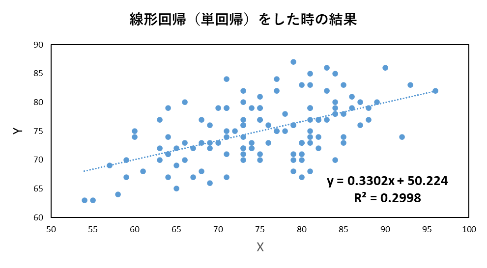
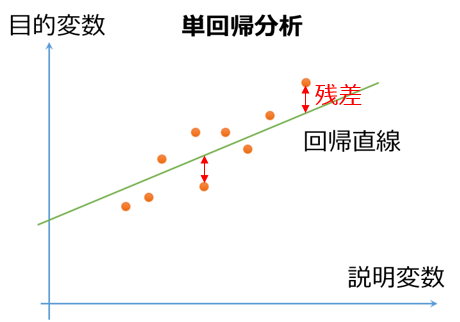
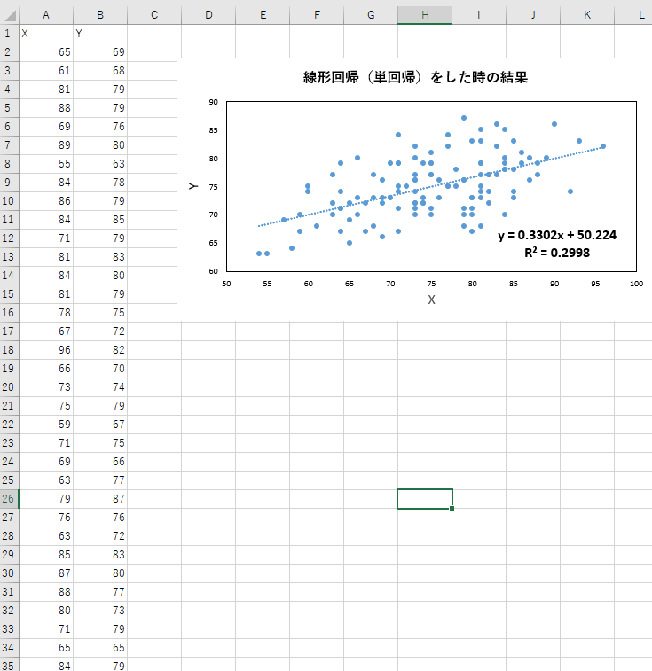
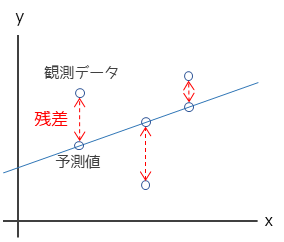
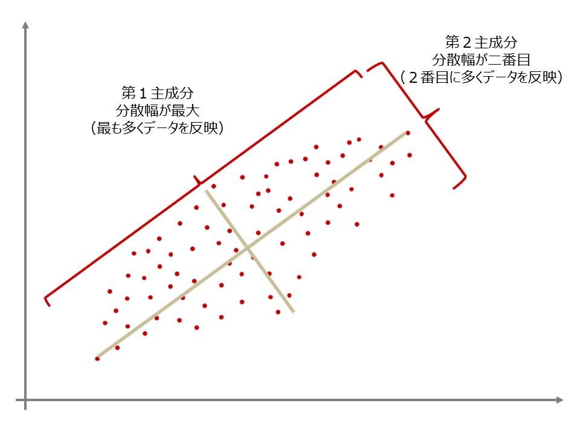
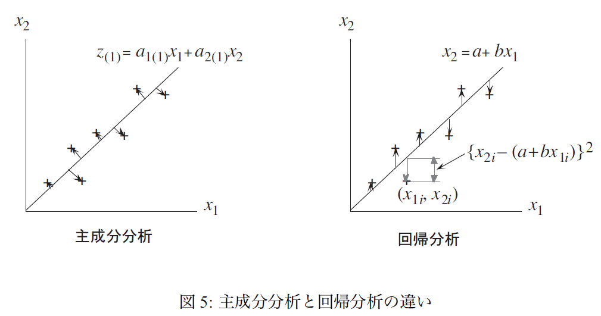

# 線形回帰（単回帰分析）を1から実装して理解を深めてみよう

この記事は、MATLABアドベントカレンダー（その2）の4日目の記事として書かれています。

[https://qiita.com/advent-calendar/2022/matlab](https://qiita.com/advent-calendar/2022/matlab)

# 1 はじめに

以下の図のように、エクセルなどで、直線で回帰する（フィッティング）した経験がある方も多いかもしれません。

以下の図では、y = 0.33x + 50.2 という式が得られています。



例えば、これにより、データ同士の相関関係を知ることができ、非常によく用いられる解析方法です。

このような線形回帰（単回帰）の説明としては、以下のページがわかりやすかったです。

**回帰分析(単回帰分析)をわかりやすく徹底解説！**

https://udemy.benesse.co.jp/data-science/data-analysis/regression-analysis.html

**実は簡単！　10分あれば回帰分析ができます**

[https://cacco.co.jp/datascience/blog/data-analysis/928/](https://cacco.co.jp/datascience/blog/data-analysis/928/)

よく用いられる手法ではありますが、それを実際に、導出し、自分の手で（プログラミングやExcelを使って）検算したことのある人は、

あまり多くないかもしれません。ここでは、自分の勉強のまとめとして、線形回帰の中でも、1つの変数を用いた、単回帰の導出を行い、さらに、複数の方法での実装（プログラミング）により自身の理解が正しいことを確認します。なお、実装による確認などを通して、検算はしていますが、間違いなどあるかもしれません。その場合は教えていただけますと幸いです。

この記事の原稿や、コード、検算用のExcelファイルは以下のページに格納されています。勉強の助けになれば幸いです。

[https://github.com/KentaItakura/blog-post-about-linear-fitting1](https://github.com/KentaItakura/blog-post-about-linear-fitting1)

また、線形回帰に関しては、本記事の内容は、最初の一歩のみを紹介しています。線形回帰を実際の研究や実務に利用したい方は、

以下の動画が大変参考になると思います。

[https://www.youtube.com/watch?v=VZ-84t2U1oQ\&t=1638s](https://www.youtube.com/watch?v=VZ-84t2U1oQ&t=1638s)

  
# 2 解析方法

単回帰分析では、データによくあてはまる直線を考えます。以下に、そのイメージを示します。

直線は、数式で、y = ax+bという形で表すことができます。この直線を下の図では、緑で表しています。

単回帰分析では、この直線と、各サンプルとのちがい（残差）が最小になるような直線を求めまづ。

そのために、最小二乗法を用いていきます。

\matlabheading{}

**図出展：残差とは何か？正規分布していることの意味をわかりやすく解説！**

[https://best-biostatistics.com/correlation_regression/zansa.html](https://best-biostatistics.com/correlation_regression/zansa.html)

最小二乗法については、以下の記事がわかりやすかったです。

  
# 3 導出
## 3.1. aとbについて偏微分

サンプルのyの値と、回帰式によって求められた値（予測値）との差が小さくなることを目的とします。

差分については、単純に引き算をすると、マイナスになった場合とプラスになった場合で誤差が相殺されてしまうため、

それらの2乗の値を考えます。そして、この誤差の2乗の値の和（残差平方和）が最小となる、aとbを求めたいと思います。

aとbとは、さきほど示したような、y = ax+bの式の傾きと切片のことです。

この残差平方和をEとします。また、のちの計算結果をよりシンプルにするため、1/2を係数として付けておきます。


...(1)

このEを最小とするために、aとbの値について微分（偏微分）をして、そのときの値がゼロになるときのことを考えます。

ここで、(1)の中に含まれる以下の部分をXと置きます。


...(2)

まずは、aについて偏微分することを考えます。

(2)のようにおいたため、(1)の式は、ある関数に別の関数が入っている関数になります。

そこで、以下のような、合成関数の微分を行います。

https://univ-juken.com/gosei-kansu

  

... (3)

式(2)をaで微分すると、であるため、(3)は以下のように展開できます。


...(4)

各項を個別に分けて、


...(5)

(5)のようになりました。

同様に、以下の(1)式をbで偏微分します。


...(1を再掲）

という式において、ここでも以下のようにXを定める。


...(2を再掲）

合成関数の微分の式は以下のようになる。

  

...(6)

(2)式において、bにて微分を行うと、1になるため、


...(7)

となり、さらに式を整理すると、


...(8)


...(9)


...(10)

このようになります。

## 3.2. 正規方程式を解く

3.1での偏微分の結果を整理すると以下のような2つの式（正規方程式）を得ることができます。


...(11)


...(12)

この(11)および(12)式を解くと、aとbの値、つまり、xとyの値が与えられたときの、

回帰式の傾きと切片を求めることができます。

(12)式の2項目はbNであるため、


...(13)

となります。この式をbについて解いて、


...(14)

を得ることができます。

この(14)を(11)に代入します。


...(15)

さらに、aについてまとめて、


...(16)

となります。

さらにaについて解くことで、


...(17)

となりました。この結果を(14)に代入して、


...(18)

となりました。これにより、傾きと切片の値を求めることができました。

# 4. コーディングをもとに検算

ここで、3章の結果が正しいかどうかを、実際にコーディングして確かめてみます。以下の3つの結果が同じになるかを検証します。

   1.  MATLABのregress関数にて、単回帰分析を行った場合の傾きと切片の値 
   1.  Excelにて、単回帰分析を行った場合の傾きと切片の値 
   1.  MATLABにて3章の結果を1から書いて計算させたときの、傾きと切片の値 

## 4.1. MATLABのregress関数にて、単回帰分析を行った場合の傾きと切片の値

MATLABにて、デフォルトで読み込み可能な、examgradsデータを利用します。ここでは、データの内容については飛ばし、

傾きと切片の値が一致するかを検証します。

データをロードします。

```matlab:Code
load examgrades
```

yとXの値を設定します。

```matlab:Code
y = grades(:,5);
X = [ones(size(grades(:,1))) grades(:,1)];
```

regress関数で単回帰分析を行います。

```matlab:Code
[mdl,~,r,rint] = regress(y,X);
disp('傾きの値')
```

```text:Output
傾きの値
```

```matlab:Code
disp(mdl(2))
```

```text:Output
    0.3302
```

```matlab:Code
disp('切片の値')
```

```text:Output
切片の値
```

```matlab:Code
disp(mdl(1))
```

```text:Output
   50.2237
```

このように、傾きと切片の値をMATLABの関数で計算できました。次はExcelにて同様の計算を行います。

## 4.2 Excelにて、単回帰分析を行った場合の傾きと切片の値

4.1にて用いたデータをコピーアンドペーストして、「近似曲線」の機能を用いて、

傾きと切片の値を計算しました。

4.1と同じ、傾きと切片の値が計算されており、まずは、4.1および4.2で、ソフトウェアの関数や機能にてうまく値が計算できたと思われます。



## 4.3 MATLABにて3章の結果を1から書いて計算させたときの、傾きと切片の値

ここが本番の計算です。さきほど導出した、(17) (18)式を用いて、傾きと切片の値を計算します。


...(17を再掲)


...(18を再掲)

以下のように短い行数で書いてみます。

```matlab:Code
x = grades(:,1);
bunshi_a = sum(x.*y)-1/numel(x)*sum(x)*sum(y);
bumbo_a = sum(x.^2)-1/numel(x)*(sum(x)^2);
a = bunshi_a/bumbo_a
```

```text:Output
a = 0.3302
```

```matlab:Code
b = -1/numel(x)*sum(x)*a+1/numel(x)*sum(y)
```

```text:Output
b = 50.2237
```

さきほどの、4.1および4.2での結果と一致しました。3章での計算が正しかったと考えられます。

ひとまず、ここまでで、簡単にですが、単回帰分析について、第一段階の理解ができたことにします。

# 5. 行列を用いて解いた場合

4章では、3章の理解が正しいことを確かめることができました。

今回用いているMATLABでは、行列計算がやりやすいです。

そこで、3章で出てきた正規方程式を振り返ります。


...(11の再掲)


...(12の再掲)

上の連立方程式は、以下のように行列をもって表すことができます。

 

...(19)

逆行列を用いて、aとbは以下のように求めることができます。

$$\;$$

...(20)

この計算は、以下のように簡単に実行可能です。

```matlab:Code
ab = inv([sum(x.^2) sum(x); sum(x) numel(x)])*[sum(x.*y);sum(y)]
```

```text:Output
ab = 2x1    
    0.3302
   50.2237

```

このように、行列を用いた計算でも、正しく傾きと切片の値を計算できています。

今回は、単回帰分析で、変数が2つしかなかったため、3章のように解くことができましたが、

より多くの変数になると大変です。行列式を用いた導出や計算は非常に有効です。

# 6. 単回帰分析の性質の例
## 6.1 推定された回帰直線は、サンプルのxとyの平均を通る

切片の値は(14)で以下のように示されることがわかりました。


すると、回帰式は、


...(21)

となり、さらにaについて整理すると、


...(22)

となる。

　および　は、xやyを全て足して、サンプル数で割った値、つまり平均です。

そのため、

y = a(x-xの平均)+(yの平均)　となり、つまり、

推定された回帰直線は、サンプルのxとyの平均を通るということがわかります。

## 6.2 回帰残差の和はゼロとなる

単回帰分析にて、回帰を行っても、完全には説明できず、実際の値と、回帰した時の値の差（回帰残差 residual）が生まれます。

導出においては、この残差の二乗の和が最小になるようにしていました。

ここでは、この残差（2乗をしない）の和について考えます。



図出展：残差プロット

https://corvus-window.com/all_residual-plot/

以下のように、導出の段階で得た正規方程式を変形させてみます。


...(12の再掲)


...(23)

という式を得ることができました。

つまり、観測値yと回帰式によって得た値の差分をとり、それをサンプル数だけ足していくと0になります。つまり、

回帰残差の和はゼロとなることがわかりました。

## 6.3 回帰残差とxの値はベクトルとして直交している

6.2と同様に、以下の正規方程式を変形します。


...(11の再掲)


...(24)

つまり、回帰残差とxの値の内積がゼロであり、直交しているということを示しています。

# 7. 疑問点：線形回帰と主成分分析では何が異なるのか

主成分分析では、以下のように、その軸の分散が最大になるように、新たな軸を作っていました。

以下の図の、十字の軸は、線形回帰のときの回帰直線に似ています。



画像出典：株式会社[インテージ](http://d.hatena.ne.jp/keyword/%A5%A4%A5%F3%A5%C6%A1%BC%A5%B8)さま：主成分分析とは

[https://www.intage.co.jp/glossary/401/](https://www.intage.co.jp/glossary/401/)

  

主成分分析については、私の過去の記事も見ていただけますと幸いです。

[https://kentapt.hatenablog.com/entry/2022/02/16/182532](https://kentapt.hatenablog.com/entry/2022/02/16/182532)

  

調べてみると、以下のようなわかりやすい資料がありました。

  

以下の文章および図は、浅野晃先生、応用統計学（2008 年度前期）　第６回(08. 5. 15)からの引用です。

=====引用開始=====

「分散が最大の軸」という表現で第１主成分を表現しましたが，もっと明確にいえば「多次元データを，それらがもつ価値をなるべく損なわないように，１次元の値（主成分得点）に縮約したもの」ということができます．また，図3 から明らかなように，第１主成分に投影することによって生じた価値の損失は，第２主成分によって表現されていることがわかります．ところで，この「各データと，その軸上への投影とのへだたりの２乗の合計が最小」という考え方は，回帰直線による直線のあてはめとよく似ています．回帰分析では，被説明変数の分散を，回帰直線からみた分散で何パーセント表現できるかを，回帰直線の当てはまり具合と考え，決定係数で表しました．しかし，両者の間には大きく違うところがあります（図5）．図3 からわかるように，主成分分析では，各データから第１主成分軸に垂線を下ろしたときの，各垂線の長さの２乗を最小にしています．これに対して，回帰分析では，各データから回帰直線に対してx1 軸に垂直に線分をひき，その長さの２乗を最小にしています．回帰分析では「x1 でx2 を説明する」あるいは「x1 からx2 を予想する」という考えにもとづいており，説明変数と被説明変数の区別があるので，x2 軸に沿ったへだたりを計算しています．主成分分析ではこのような区別はなく，どちらでどちらを説明しているわけでもないので，軸と各データとの「距離」を最小化の対象としています．



=====引用終了=====

「回帰分析では「x1 でx2 を説明する」あるいは「x1 からx2 を予想する」という考えにもとづいており」という点と、主成分分析ではそのような関係は想定しておらず、新たな主成分軸と各データとの距離そのものに主眼がおかれている、という点が納得がいき、非常に勉強になりました。

以下の、記事でも、回帰直線への垂線の長さを最小化する問題を解くと、ラグランジュの未定乗数法に

https://takmin.hatenablog.com/entry/2020/09/17/135353

# 8. その他：ガウスとルジャンドルとの論争

最小二乗法の発見に関しては以下のようなストーリーがあるそうです。以下の文章は入門統計学から引用しています。

=====引用開始=====

最小二乗法は、ドイツの天才学者であるガウスが小惑星セレスの軌道の計算に使ったことが始まりであると現在では知られています(1801年)。しかしガウスは自分の業績を公表することに無頓着でした。そのため、ルジャンドルというフランスの数学者がガウスよりも先（1805年）に論文として同様の理論を発表してしまい、他の数学者も巻き込んでの大論争になってしまいました。

=====引用終了=====

https://www.amazon.co.jp/%E5%85%A5%E9%96%80-%E7%B5%B1%E8%A8%88%E5%AD%A6-%E2%88%92%E6%A4%9C%E5%AE%9A%E3%81%8B%E3%82%89%E5%A4%9A%E5%A4%89%E9%87%8F%E8%A7%A3%E6%9E%90%E3%83%BB%E5%AE%9F%E9%A8%93%E8%A8%88%E7%94%BB%E6%B3%95%E3%81%BE%E3%81%A7%E2%88%92-%E6%A0%97%E5%8E%9F-%E4%BC%B8%E4%B8%80/dp/4274068552

# 9. 簡単なまとめ

この記事では、1変数のみの回帰直線の係数の計算方法（単回帰による回帰直線の傾きと切片の計算方法）についてまとめました。

私の理解による結果と、MATLABやExcelによる計算結果が一致しており、よかったです。

決定係数といった他の重要な事項に触れることができませんでしたが、今回は記事が長くなってしまったため、ひとまずここで一区切りとしたいと思います。今回の勉強にあたり、本文にて紹介した皆様の情報が非常に頼りになりました。ありがとうございました。

# 10. 参考文献（本文中に記載のないもの）

**最小二乗法の基礎を丁寧に**

[https://qiita.com/Ushio/items/0411b0db1ed36d398bbf](https://qiita.com/Ushio/items/0411b0db1ed36d398bbf)

**回帰直線の式を最小二乗法により計算する**

https://ictsr4.com/py/r0131.html

**ガウスとルジャンドルとの論争について**

[https://ill-identified.hatenablog.com/entry/2015/05/03/001326](https://ill-identified.hatenablog.com/entry/2015/05/03/001326)

**永田靖、棟近雅彦共著：多変量解析入門**

[https://www.amazon.co.jp/%E5%A4%9A%E5%A4%89%E9%87%8F%E8%A7%A3%E6%9E%90%E6%B3%95%E5%85%A5%E9%96%80-%E3%83%A9%E3%82%A4%E3%83%96%E3%83%A9%E3%83%AA%E6%96%B0%E6%95%B0%E5%AD%A6%E5%A4%A7%E7%B3%BB-%E6%B0%B8%E7%94%B0-%E9%9D%96/dp/4781909809](https://www.amazon.co.jp/%E5%A4%9A%E5%A4%89%E9%87%8F%E8%A7%A3%E6%9E%90%E6%B3%95%E5%85%A5%E9%96%80-%E3%83%A9%E3%82%A4%E3%83%96%E3%83%A9%E3%83%AA%E6%96%B0%E6%95%B0%E5%AD%A6%E5%A4%A7%E7%B3%BB-%E6%B0%B8%E7%94%B0-%E9%9D%96/dp/4781909809)

**東京大学教養学部統計学教室  (編集)　統計学入門 (基礎統計学Ⅰ) **

[https://www.amazon.co.jp/gp/product/4130420658/ref=dbs_a_def_rwt_hsch_vapi_taft_p1_i0](https://www.amazon.co.jp/gp/product/4130420658/ref=dbs_a_def_rwt_hsch_vapi_taft_p1_i0)

**最小二乗法① 数学的性質　経済統計分析 (2013年度秋学期)**

\href{http://www2.toyo.ac.jp/~mihira/keizaitoukei2014/ols1.pdf}{http://www2.toyo.ac.jp/\textasciitilde{}mihira/keizaitoukei2014/ols1.pdf}

**MATLABドキュメンテーション：regress**

https://jp.mathworks.com/help/stats/regress.html
